# Workshop Booking Portal (React)

A responsive and interactive workshop booking web application built using React.  
It allows users to explore workshops, apply filters, search, and view insights through charts.

## Features

-Login page with authentication UI (frontend only)
-Workshop listing with dynamic cards
-Search workshops by title
-Filters:
  -Domain (Web, Data, Security)
  -Duration (Short, Medium, Long)
  -State-wise filtering
  -Date range filtering (Start & End date)
-Sorting by duration (ascending/descending)
-Interactive chart showing workshops by domain
-Clear filters functionality
-Responsive and clean UI design
-Animated gradient background and modern card layout

---

# Tech Stack

- React.js (Functional Components)
- React Hooks (useState, useNavigate)
- CSS3 (Custom styling)
- React Router DOM

---

## 📁 Improvements & Features

## Improvements:
- Better UI layout and spacing
- Added filtering and sorting features
- Improved mobile responsiveness
- Calendar-based date input
- Hamburger menu for navigation
- Interactive charts for insights

## Features

- Login page with authentication UI (frontend only)
- Hamburger menu for navigtaion 
- Workshop listing with dynamic cards
- Search functionality
- Filters:
  - Domain
  - Duration
  - State
  - Date range
- Sorting by duration
- Interactive charts
- Clear filters option
- Responsive UI design

| Old UI                                    | New UI                                    |
| ----------------------------------------- | ----------------------------------------- |
| .png) | 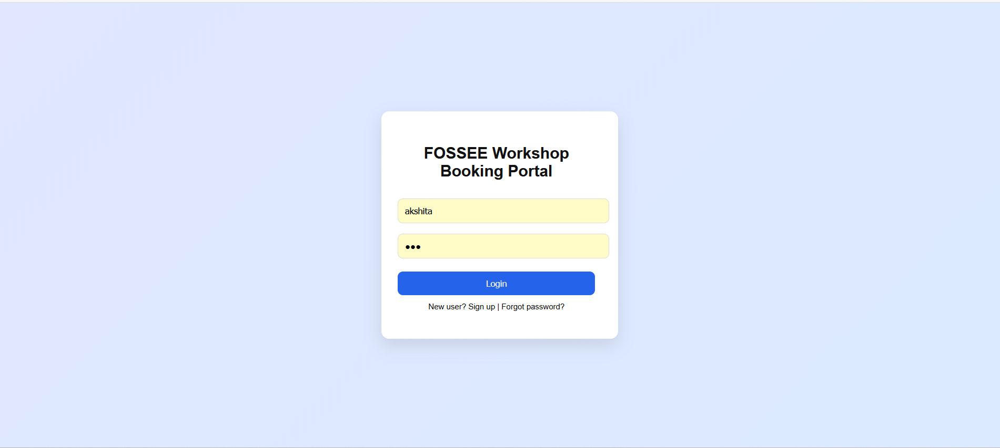 |

Improvements:  Cleaner UI, login pages created for easy access

| Old UI                                    | New UI                                    |
| ----------------------------------------- | ----------------------------------------- |
| 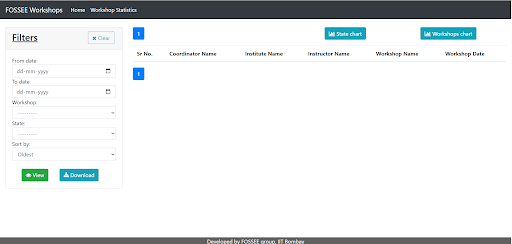 | 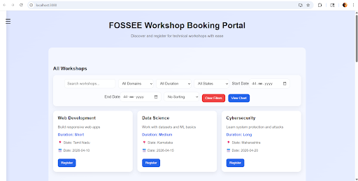 |

| Old UI                                    | New UI                                    |
| ----------------------------------------- | ----------------------------------------- |
| 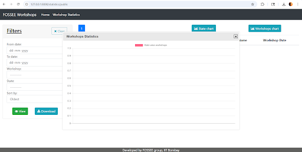 | 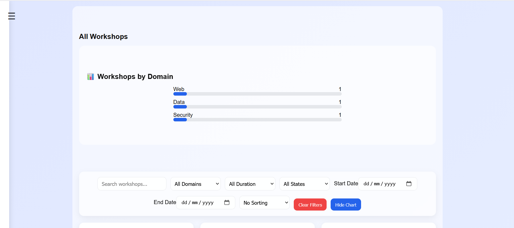 |

- Format of Chart generated is easier to read for the users in the new UI.

| Old UI                                    | New UI                                    |
| ----------------------------------------- | ----------------------------------------- |
|  | 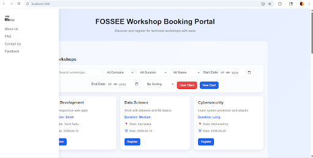 |

- Hamburger style menu has been employed in new UI to ensure easy ccess of different parts of the webpage for mobile users.

| Old UI                                    | New UI                                    |
| ----------------------------------------- | ----------------------------------------- |
|  | 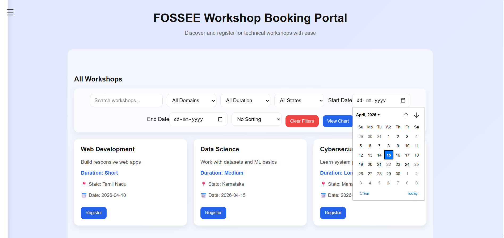 |

- Manual entry of dates in old UI in a backward fashion. Calender Input employed in New UI to allow error-free input collection

| Old UI                                    | New UI                                    |
| ----------------------------------------- | ----------------------------------------- |
|  | 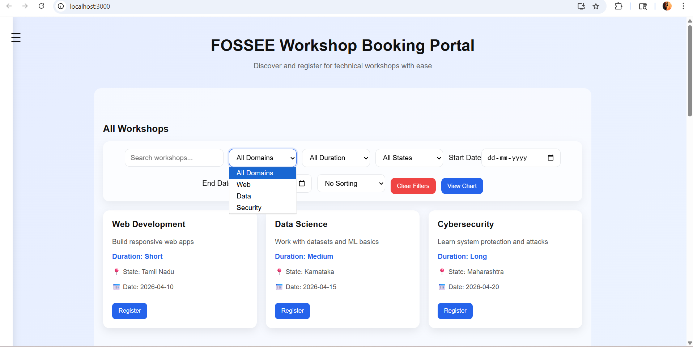 |

- New filter added : filter by domain - to allow users to filter courses by domain

| Old UI                                    | New UI                                    |
| ----------------------------------------- | ----------------------------------------- |
|  | 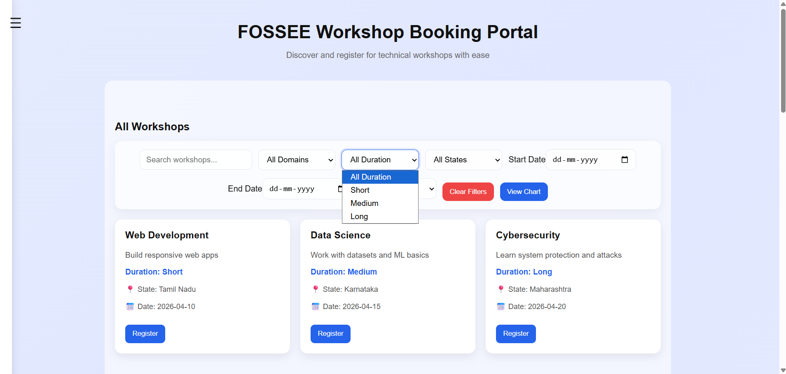 |

- New filter added : filter by duration - short, medium, long workshops.

Old UI , New UI screenshots:

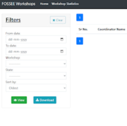

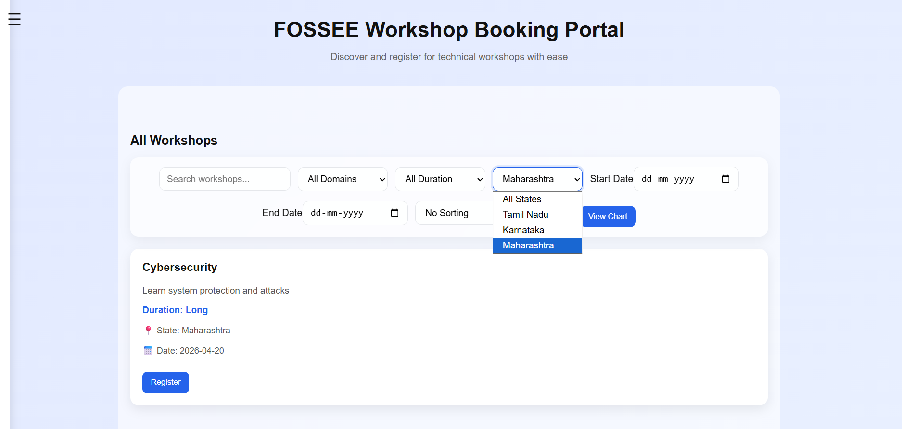

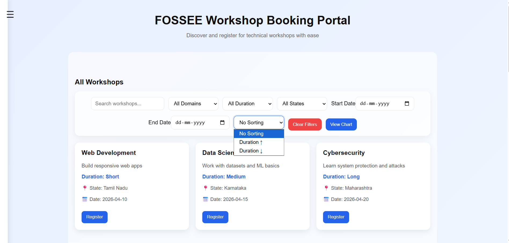

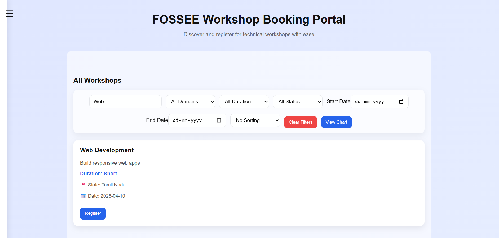

NEW UI:
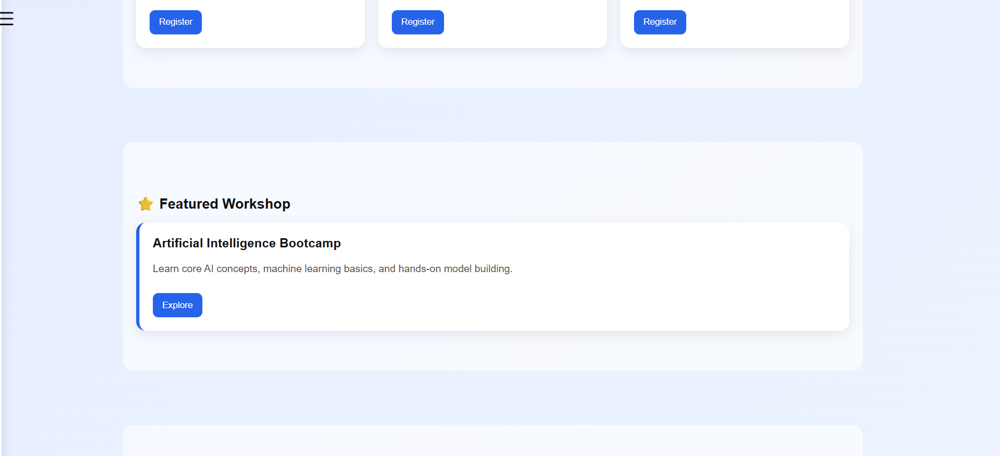
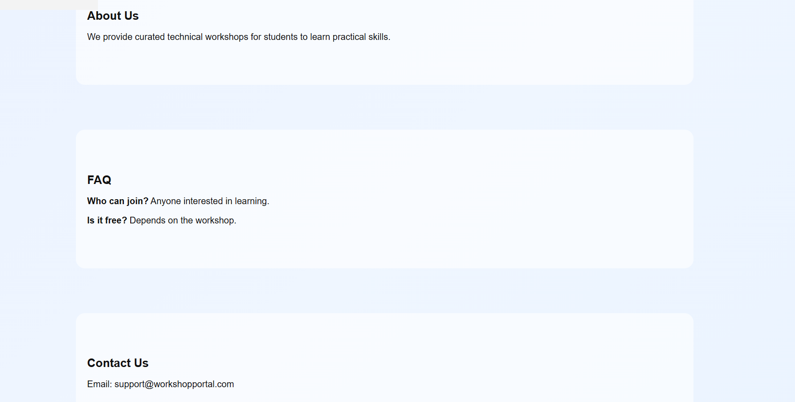

What design principles guided your improvements?

The redesign was guided by principles of clarity, consistency, and usability. The goal was to make the interface more intuitive by improving visual hierarchy and reducing clutter. I focused on grouping related features together, such as placing filters in a single toolbar and ensuring workshop cards had a uniform structure. Consistent spacing, color usage, and typography were used to create a clean and modern UI. The design also follows a card-based layout to improve readability and make information easier to scan quickly.

I also took inspiration from websites that I really enjoyed using - websites that I felt had simple, yet impressive UI. A little goes a long way.

QUESTIONS AND ANSWERS:

Q) How did you ensure responsiveness across devices?

A) Responsiveness was achieved using flexible layouts such as CSS Grid and Flexbox, which automatically adapt to different screen sizes. The workshop cards use auto-fit and minmax to adjust the number of columns based on available space. Input fields, buttons, and filters were designed to wrap and stack properly on smaller screens.The sidebar navigation and hamburger menu improve usability on mobile devices by saving screen space while keeping navigation accessible.

Multiple trial runs on smaller screen dimensions ensured uniform responsiveness throughout the entire development process.

Q)What trade-offs did you make between the design and performance?

A)A key trade-off was adding interactive features such as filtering, sorting, and chart rendering, which slightly increased UI complexity. 

While these features improve usability and user experience, they also increase the number of state updates in React. To balance this, I kept the data handling lightweight by using in-memory filtering instead of external API calls or heavy libraries.

 Some advanced animations or chart libraries were avoided to maintain smooth performance and fast loading times.

 Some features that I intially wisheded to include I ended upp deciding against becasue it made the web page unnescessarily heavy and the trade off wasnt justified.
 Hence, I ended up sticking to clean, well tested features that run smoothly and provide a good ux. 

Q)What was the most challenging part of the task and how did you approach it?

A)The most challenging part was implementing multiple filters (domain, duration, state, and date range) while keeping the UI responsive and logically consistent. Managing combined filtering conditions required careful state handling in React.

 I approached this by breaking the logic into smaller conditions and combining them in a single filter function. Debugging rendering issues and ensuring all filters worked together without conflicts helped strengthen my understanding of React state management.

// docs update 
