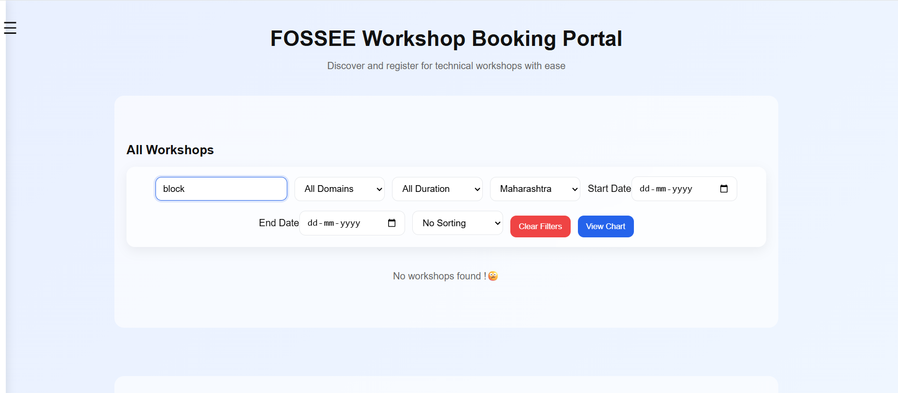

# Workshop Booking Portal (React)

A responsive and interactive workshop booking web application built using React.  
It allows users to explore workshops, apply filters, search, and view insights through charts.

## Setup Instructions

1. Clone the repository
git clone https://github.com/your-username/workshop-redesign.git

2. Move into the project folder
cd workshop-redesign

3. Install dependencies
npm install

4. Run the project
npm start

---

# Tech Stack

- React.js (Functional Components)
- React Hooks (useState, useNavigate)
- CSS3 (Custom styling)
- React Router DOM

---

## 📁 Improvements & Features

## Improvements:
- Better UI layout and spacing
- Added filtering and sorting features
- Improved mobile responsiveness
- Calendar-based date input
- Hamburger menu for navigation
- Interactive charts for insights

## Features

- Login page with authentication UI (frontend only)
- Hamburger menu for navigtaion 
- Workshop listing with dynamic cards
- Search functionality
- Filters:
  - Domain
  - Duration
  - State
  - Date range
- Sorting by duration
- Interactive charts
- Clear filters option
- Responsive UI design
- Animated gradient background and modern card layout

### OLD UI VS NEW UI:

## Login Page

### Before

### After

Improvements:  Cleaner UI, login pages created for easy access

------------------------------------------------------------------------------

## Dashboard

### Before

### After

Improvements:  
- Added filtering and sorting features
- Improved mobile responsiveness
- Calendar-based date input
- Hamburger menu for navigation
- Interactive charts for insights

------------------------------------------------------------------------------

## Filters

### Before

### After

filter by domain:

filter by state:

filter by course duration:

sort by course duration:

Improvements:  
- Added filtering and sorting features
- domain,length based filtration

------------------------------------------------------------------------------

## Filtered Results

### Before

### After:

when no results are found:

Improvements:  
- Clean filtered workshop cards - clear, clean UI with date,name,description
  of course mentioned clearly

------------------------------------------------------------------------------

## Charts

### Before

### After

Improvements: 
- Interactive charts which are easier to read for insights
------------------------------------------------------------------------------

## NEW FEATURES ADDED:

# New feature added : Hamburger Menu

## New feature added : date - calender input

## New feature added : domain based filter

## New feature added : course duration based filter
filter by course duration:

# New feature added :  featured workshops

# New feature added :  About us, FAQs and Contact us sections

------------------------------------------------------------------------------

QUESTIONS AND ANSWERS:

Q) What design principles guided your improvements?

A) The redesign was guided by principles of clarity, consistency, and usability. The goal was to make the interface more intuitive by improving visual hierarchy and reducing clutter. I focused on grouping related features together, such as placing filters in a single toolbar and ensuring workshop cards had a uniform structure. Consistent spacing, color usage, and typography were used to create a clean and modern UI. The design also follows a card-based layout to improve readability and make information easier to scan quickly.

I also took inspiration from websites that I really enjoyed using - websites that I felt had simple, yet impressive UI. A little goes a long way.

------------------------------------

Q) How did you ensure responsiveness across devices?

A) Responsiveness was achieved using flexible layouts such as CSS Grid and Flexbox, which automatically adapt to different screen sizes. The workshop cards use auto-fit and minmax to adjust the number of columns based on available space. Input fields, buttons, and filters were designed to wrap and stack properly on smaller screens.The sidebar navigation and hamburger menu improve usability on mobile devices by saving screen space while keeping navigation accessible.

Multiple trial runs on smaller screen dimensions ensured uniform responsiveness throughout the entire development process.

------------------------------------

Q)What trade-offs did you make between the design and performance?

A)A key trade-off was adding interactive features such as filtering, sorting, and chart rendering, which slightly increased UI complexity. 

While these features improve usability and user experience, they also increase the number of state updates in React. To balance this, I kept the data handling lightweight by using in-memory filtering instead of external API calls or heavy libraries.

 Some advanced animations or chart libraries were avoided to maintain smooth performance and fast loading times.

 Some features that I intially wisheded to include I ended upp deciding against becasue it made the web page unnescessarily heavy and the trade off wasnt justified.
 Hence, I ended up sticking to clean, well tested features that run smoothly and provide a good ux. 

------------------------------------

Q)What was the most challenging part of the task and how did you approach it?

A)The most challenging part was implementing multiple filters (domain, duration, state, and date range) while keeping the UI responsive and logically consistent. Managing combined filtering conditions required careful state handling in React.

 I approached this by breaking the logic into smaller conditions and combining them in a single filter function. Debugging rendering issues and ensuring all filters worked together without conflicts helped strengthen my understanding of React state management.

------------------------------------

// docs update 
